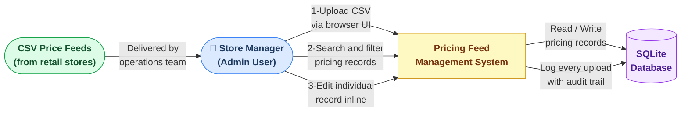
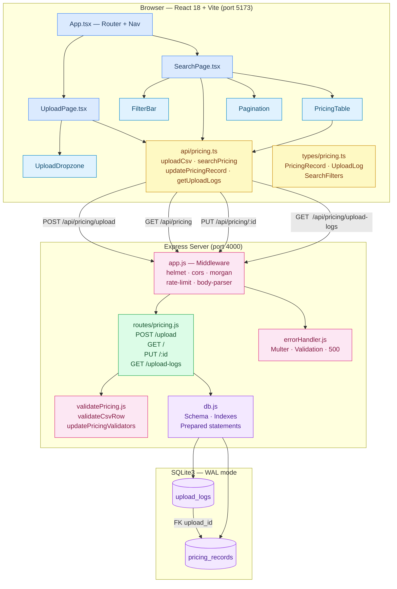
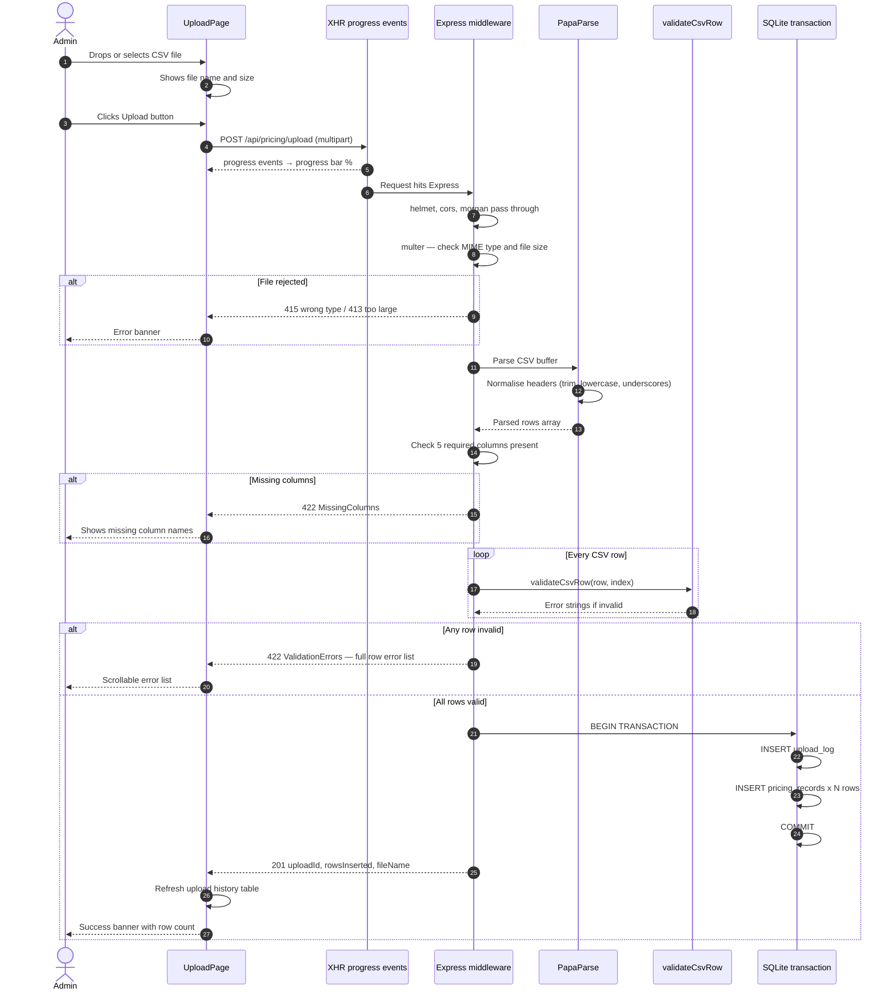
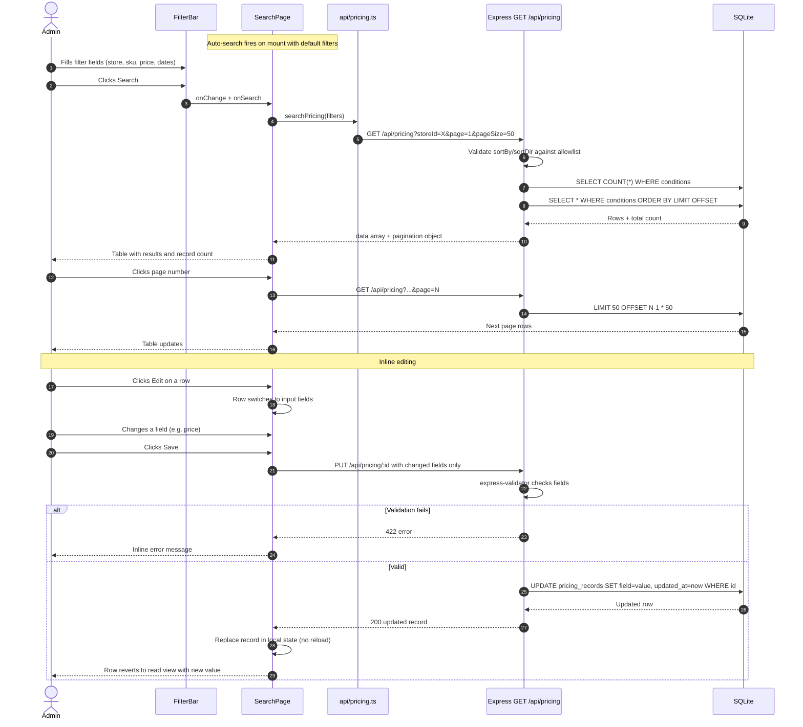

# Architecture Deliverables
## Retail Pricing Feed Management System

> **Stack:** React 18 + Vite + TypeScript + TailwindCSS (client) · Node.js + Express (server) · SQLite3/better-sqlite3 (database)

---

## 1. Context Diagram

> Who uses the system and what does it touch?



---

## 2. Solution Architecture

### 2a. Component Map



---

### 2b. Upload Flow



---

### 2c. Search and Edit Flow



---

## 3. Design Decisions

| # | Decision | Why |
|---|---|---|
| D1 | SQLite + better-sqlite3 | Zero infrastructure. Synchronous API simplifies Express handlers. WAL enables concurrent reads. Swap path to PostgreSQL is straightforward if scale demands. |
| D2 | All-or-nothing CSV validation | Every row validated before any write. No partial state. Users get a full error list to fix before re-uploading. |
| D3 | In-memory CSV parsing | multer memoryStorage + PapaParse from Buffer. No temp files. Header normalisation (trim → lowercase → underscores) makes format forgiving. |
| D4 | SQLite transaction for bulk insert | upload_log + all pricing_records in one transaction. Any failure rolls back everything. Audit log is never out of sync. |
| D5 | Allowlist for ORDER BY | sortBy and sortDir checked against hardcoded arrays before SQL interpolation. Prevents ORDER BY injection while allowing dynamic sorting. |
| D6 | XHR instead of fetch for uploads | XMLHttpRequest.upload exposes progress events for accurate % progress bar. fetch API does not support upload progress in mainstream browsers. |
| D7 | Vite /api proxy | Proxies /api to port 4000 in dev. Client and server appear same-origin. Eliminates dev CORS issues without any production config change. |
| D8 | Covering indexes on pricing_records | Indexes on store_id, sku, record_date, (store_id, sku), product_name COLLATE NOCASE match the most common filter patterns. |
| D9 | COALESCE partial UPDATE | UPDATE SET field = COALESCE(@field, field). PUT endpoint only needs changed fields. Inline editor sends only modified fields. |
| D10 | Centralised error handler | One middleware handles multer, validation, and 500 errors uniformly. Stack traces stripped in production. |

---

## 4. Non-Functional Requirements

### Performance

| Area | Implementation |
|---|---|
| Query speed | 5 covering indexes, WAL mode, PRAGMA cache_size = -64000 (64 MB) |
| Upload throughput | multer memory storage, single-pass PapaParse, bulk insert in one transaction |
| Pagination cap | Results hard-capped at 200 rows per page |
| Frontend load | Vite tree-shaking and code-splitting, TailwindCSS purged at build |
| Rate protection | express-rate-limit: 200 req / 60 s per IP |

### Security

| Threat | Mitigation |
|---|---|
| HTTP header attacks | helmet sets CSP, X-Frame-Options, HSTS, X-XSS-Protection |
| CORS abuse | Strict origin allowlist from CORS_ORIGIN env var |
| Malicious file upload | multer rejects non-CSV MIME types (415) and oversized files (413) |
| SQL injection via filters | Parameterised prepared statements for all user values |
| SQL injection via sort | sortBy and sortDir validated against hardcoded allowlists |
| Input tampering PUT | express-validator validates type and length for every body field |
| API abuse | Rate limiter at /api/ prefix with RFC-compliant headers |
| Info leakage | errorHandler strips stack traces in NODE_ENV=production |

### Reliability and Data Integrity

| Concern | Implementation |
|---|---|
| Atomic uploads | Entire bulk insert in a single SQLite transaction |
| Audit trail | upload_logs records every attempt with filename, row count, outcome |
| Referential integrity | PRAGMA foreign_keys = ON; pricing_records.upload_id references upload_logs |
| Graceful shutdown | SIGTERM/SIGINT handlers drain in-flight requests before exit |
| DB durability | PRAGMA synchronous = NORMAL with WAL balances durability and speed |

### Usability and Maintainability

| Goal | Implementation |
|---|---|
| Frictionless upload | Drag-and-drop zone, progress bar, inline CSV format hint |
| Actionable errors | Row-level error strings shown in scrollable list |
| No-reload editing | Record replaced in local React state after PUT — no page refresh |
| Responsive layout | TailwindCSS sm: lg: xl: breakpoints throughout |
| Env-driven config | PORT, DB_PATH, CORS_ORIGIN, UPLOAD_SIZE_LIMIT_MB, RATE_LIMIT_* all in .env |

---

## 5. Assumptions

1. **Internal users only** — No auth layer. Trusted retail ops staff only. JWT middleware is the extension path if external access is needed.
2. **CSV format contract** — Feeds always have the five required columns. Header matching is case-insensitive after normalisation.
3. **Reasonable file sizes** — Uploads stay under 50 MB (configurable via UPLOAD_SIZE_LIMIT_MB).
4. **Single-server deployment** — SQLite suits one process. Horizontal scaling requires migrating to PostgreSQL with a connection pool.
5. **Append-only ingestion** — Uploads always insert new rows. Duplicate (store_id, sku, record_date) combos are allowed. Idempotency would require a UNIQUE constraint + ON CONFLICT REPLACE.
6. **Date format flexibility** — Any date parseable by new Date() is accepted and normalised to YYYY-MM-DD for storage.
7. **Node.js v18+ runtime** — No container orchestration assumed. A process manager (pm2, systemd) is expected for production.

---

## 6. Source for the Implementation

### Directory Structure

```
Round2/
├── ARCHITECTURE.md              <- this document
├── sample_feed.csv              <- example CSV (10 stores, 5 columns, 21 rows)
│
├── server/                      Express backend
│   ├── .env                     PORT=4000, DB_PATH, CORS_ORIGIN, upload/rate limits
│   ├── package.json             express, better-sqlite3, multer, papaparse,
│   │                            helmet, cors, morgan, express-rate-limit,
│   │                            express-validator, uuid, dotenv
│   └── src/
│       ├── index.js             Entry point — app.listen + graceful shutdown
│       ├── app.js               Middleware stack: helmet->cors->morgan->rate-limit->routes
│       ├── db.js                SQLite init, PRAGMA tuning, schema DDL, indexes
│       ├── routes/
│       │   └── pricing.js       Upload, list, update, upload-logs handlers
│       └── middleware/
│           ├── validatePricing.js  validateCsvRow() + express-validator for PUT
│           └── errorHandler.js     Central handler for multer, validation, 500 errors
│
└── client/                      React 18 + Vite + TypeScript + TailwindCSS
    ├── index.html               HTML shell
    ├── vite.config.ts           React plugin + /api proxy to port 4000
    ├── tailwind.config.js       Custom brand colour palette
    └── src/
        ├── main.tsx             Mounts <App />
        ├── index.css            @tailwind + .btn-* .input .label .card .badge-*
        ├── App.tsx              BrowserRouter + nav + Routes
        ├── types/pricing.ts     PricingRecord, UploadLog, SearchFilters, response types
        ├── api/pricing.ts       uploadCsv (XHR), searchPricing, updatePricingRecord, getUploadLogs
        ├── pages/
        │   ├── UploadPage.tsx   File select, progress, banners, upload history table
        │   └── SearchPage.tsx   Filter state, loading skeleton, results, pagination
        └── components/
            ├── UploadDropzone.tsx  Drag-and-drop + hidden file input
            ├── FilterBar.tsx       7 filter inputs + sort selects + page-size
            ├── PricingTable.tsx    Grid with per-row edit/save/cancel toggle
            └── Pagination.tsx      Smart strip with ellipsis (+-2 window)
```

### REST API Reference

| Method | Path | Description |
|---|---|---|
| POST | /api/pricing/upload | Upload CSV — validate all rows, bulk-insert in transaction |
| GET  | /api/pricing | List/filter records — 7 filters + pagination + sort |
| PUT  | /api/pricing/:id | Partial update of one record (any subset of 5 fields) |
| GET  | /api/pricing/upload-logs | Paginated upload audit history |
| GET  | /health | Health check { status: "ok", ts: "..." } |

### How to Run Locally

```bash
# Terminal 1 — Backend
cd server && npm install && npm run dev
# Runs on http://localhost:4000

# Terminal 2 — Frontend
cd client && npm install && npm run dev
# Runs on http://localhost:5173

# Quick smoke test with sample data
curl -F "file=@sample_feed.csv" http://localhost:4000/api/pricing/upload
```
