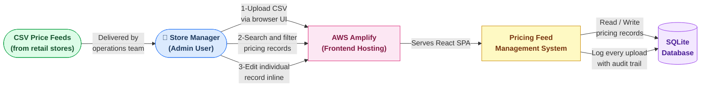
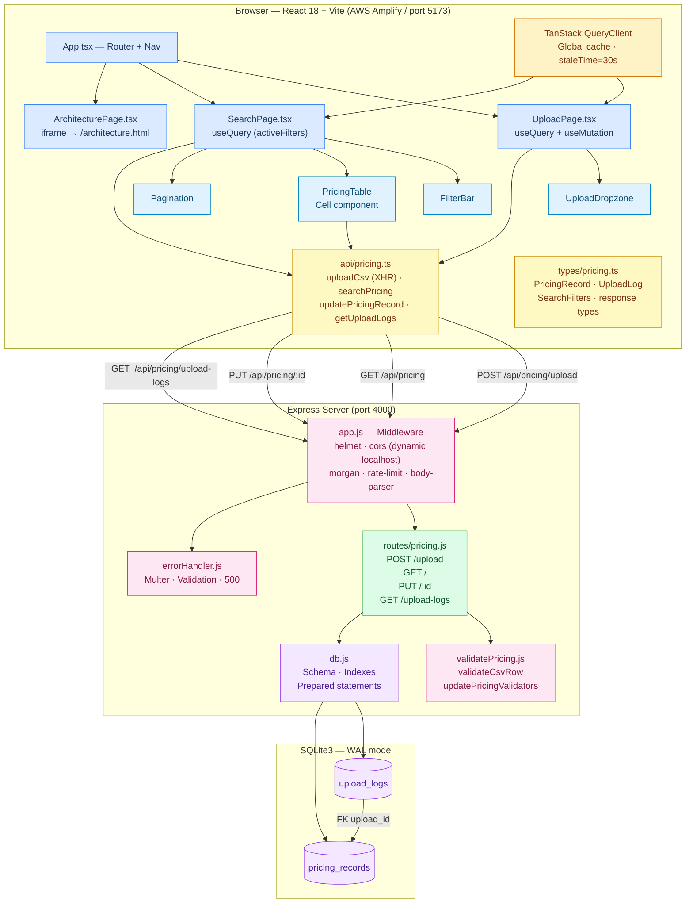
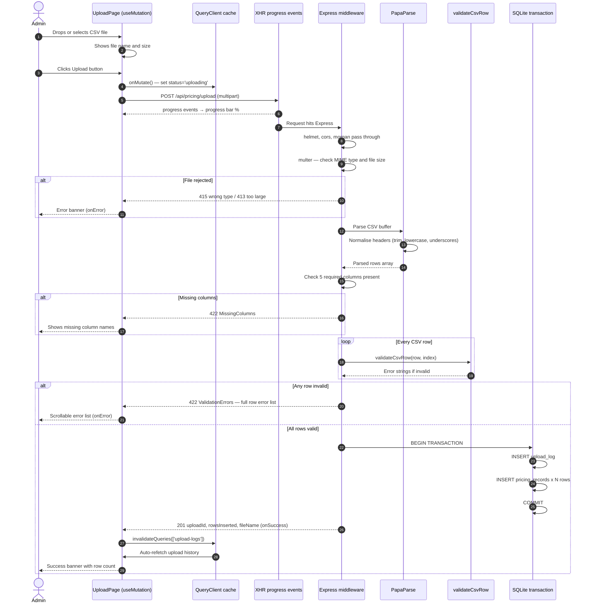
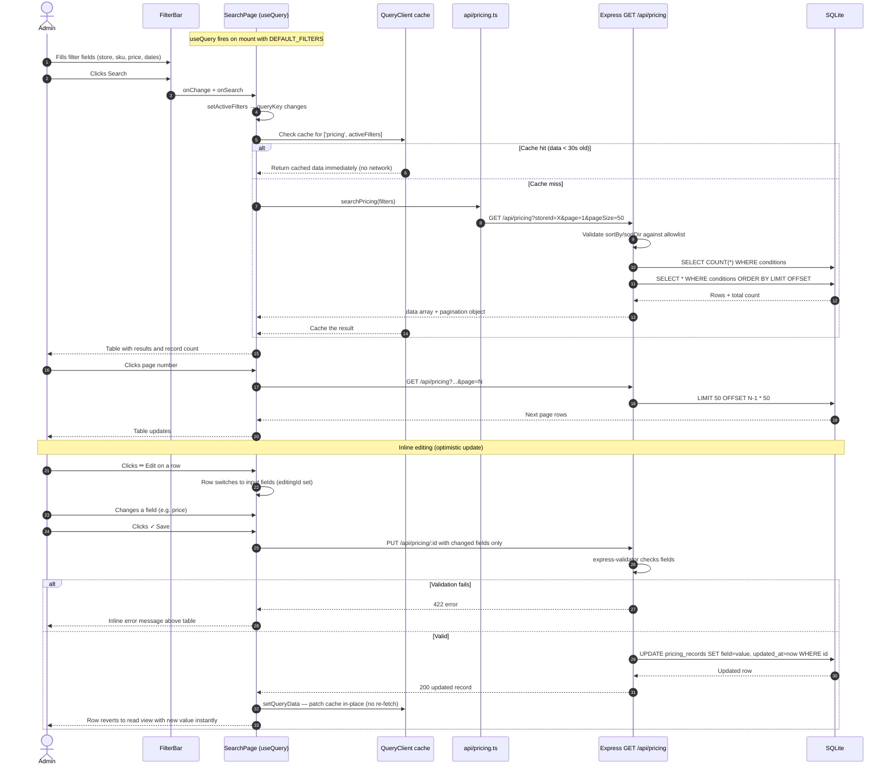

# Architecture Deliverables
## Retail Pricing Feed Management System

> **Stack:** React 18 + Vite + TypeScript + TailwindCSS (client) · TanStack Query (server-state cache) · Node.js + Express (server) · SQLite3/better-sqlite3 (database) · AWS Amplify (hosting)

---

## 1. Context Diagram

> Who uses the system and what does it touch?



---

## 2. Solution Architecture

### 2a. Component Map



---

### 2b. Upload Flow (with TanStack Query cache invalidation)



---

### 2c. Search and Edit Flow (with TanStack Query)



---

## 3. Design Decisions

| # | Decision | Why |
|---|---|---|
| D1 | SQLite + better-sqlite3 | Zero infrastructure. Synchronous API simplifies Express handlers. WAL enables concurrent reads. |
| D2 | All-or-nothing CSV validation | Every row validated before any write. No partial state. Users get a full error list to fix before re-uploading. |
| D3 | In-memory CSV parsing | multer memoryStorage + PapaParse from Buffer. No temp files. Header normalisation (trim → lowercase → underscores) makes format forgiving. |
| D4 | SQLite transaction for bulk insert | upload_log + all pricing_records in one transaction. Any failure rolls back everything. Audit log never out of sync. |
| D5 | Allowlist for ORDER BY | sortBy and sortDir checked against hardcoded arrays before SQL interpolation. Prevents ORDER BY injection. |
| D6 | XHR instead of fetch for uploads | XMLHttpRequest.upload exposes progress events for accurate % progress bar. fetch API does not support upload progress. |
| D7 | Vite /api proxy | Proxies /api to port 4000 in dev. Eliminates dev CORS issues. Production uses VITE_API_URL env var. |
| D8 | Covering indexes on pricing_records | Indexes on store_id, sku, record_date, (store_id, sku), product_name match the most common filter patterns. |
| D9 | COALESCE partial UPDATE | PUT endpoint only needs changed fields. Inline editor sends only modified fields. |
| D10 | Centralised error handler | One middleware handles multer, validation, and 500 errors uniformly. |
| D11 | TanStack Query | Replaces manual loading/error/data state boilerplate. Provides 30s cache, auto-refetch on mutation, and optimistic updates for inline editing. |
| D12 | Dynamic CORS for localhost | In development (NODE_ENV≠production) any http://localhost:* port is allowed. Fixes port conflicts when Vite auto-increments port numbers. |
| D13 | filters vs activeFilters split | FilterBar inputs update `filters` (local). Search click copies to `activeFilters` (query key). Prevents a network request on every keystroke. |
| D14 | Cell component in PricingTable | Reusable `<Cell editing display input>` component halves the JSX needed for each editable column. |
| D15 | AWS Amplify static hosting | Frontend deployed to Amplify CDN. amplify.yml points appRoot to /client. architecture.html placed in /public to be served as a static asset. |

---

## 4. Non-Functional Requirements

### Performance

| Area | Implementation |
|---|---|
| Query speed | 5 covering indexes, WAL mode, PRAGMA cache_size = -64000 (64 MB) |
| Upload throughput | multer memory storage, single-pass PapaParse, bulk insert in one transaction |
| Pagination cap | Results hard-capped at 200 rows per page |
| Frontend load | Vite tree-shaking and code-splitting, TailwindCSS purged at build |
| Rate protection | express-rate-limit: 200 req / 60 s per IP |
| Client-side cache | TanStack Query: 30s stale time, single retry, no focus-refetch |

### Security

| Threat | Mitigation |
|---|---|
| HTTP header attacks | helmet sets CSP, X-Frame-Options, HSTS, X-XSS-Protection |
| CORS abuse | Strict origin allowlist in production; dynamic localhost-only in development |
| Malicious file upload | multer rejects non-CSV MIME types (415) and oversized files (413) |
| SQL injection via filters | Parameterised prepared statements for all user values |
| SQL injection via sort | sortBy and sortDir validated against hardcoded allowlists |
| Input tampering PUT | express-validator validates type and length for every body field |
| API abuse | Rate limiter at /api/ prefix with RFC-compliant headers |
| Info leakage | errorHandler strips stack traces in NODE_ENV=production |

### Reliability and Data Integrity

| Concern | Implementation |
|---|---|
| Atomic uploads | Entire bulk insert in a single SQLite transaction |
| Audit trail | upload_logs records every attempt with filename, row count, outcome |
| Referential integrity | PRAGMA foreign_keys = ON; pricing_records.upload_id references upload_logs |
| Graceful shutdown | SIGTERM/SIGINT handlers drain in-flight requests before exit |
| DB durability | PRAGMA synchronous = NORMAL with WAL balances durability and speed |

### Usability and Maintainability

| Goal | Implementation |
|---|---|
| Frictionless upload | Drag-and-drop zone, progress bar, inline CSV format hint |
| Actionable errors | Row-level error strings shown in scrollable list |
| No-reload editing | Optimistic cache patch via setQueryData — no page refresh or re-fetch |
| Responsive layout | TailwindCSS sm: lg: xl: breakpoints throughout |
| Env-driven config | PORT, DB_PATH, CORS_ORIGIN, UPLOAD_SIZE_LIMIT_MB, RATE_LIMIT_* all in .env |

---

## 5. Assumptions

1. **Internal users only** — No auth layer. Trusted retail ops staff only.
2. **CSV format contract** — Feeds always have the five required columns. Header matching is case-insensitive.
3. **Reasonable file sizes** — Uploads stay under 50 MB (configurable via UPLOAD_SIZE_LIMIT_MB).
4. **Single-server deployment** — SQLite suits one process. Horizontal scaling requires PostgreSQL.
5. **Append-only ingestion** — Uploads always insert new rows. Duplicates are allowed.
6. **Date format flexibility** — Any date parseable by new Date() is accepted and normalised to YYYY-MM-DD.
7. **Node.js v18+ runtime** — A process manager (pm2, systemd) is expected for production.

---

## 6. Source for the Implementation

### Directory Structure

```
tigeraAlytics/
├── ARCHITECTURE.md              ← this document
├── ARCHITECTURE_VISUAL.html     ← interactive visual version (rendered at /architecture in-app)
├── amplify.yml                  ← AWS Amplify build config (appRoot: client, baseDir: dist)
├── README.md                    ← setup and run instructions
├── sample_feed.csv              ← example CSV (10 stores, 5 columns, 21 rows)
│
├── server/                      Express backend
│   ├── .env                     PORT=4000, DB_PATH, CORS_ORIGIN, upload/rate limits
│   ├── package.json             express, better-sqlite3, multer, papaparse,
│   │                            helmet, cors, morgan, express-rate-limit,
│   │                            express-validator, uuid, dotenv
│   └── src/
│       ├── index.js             Entry point — app.listen + graceful shutdown
│       ├── app.js               Middleware stack + dynamic CORS for localhost
│       ├── db.js                SQLite init, PRAGMA tuning, schema DDL, indexes
│       ├── routes/
│       │   └── pricing.js       Upload, list, update, upload-logs handlers
│       └── middleware/
│           ├── validatePricing.js  validateCsvRow() + express-validator for PUT
│           └── errorHandler.js     Central handler for multer, validation, 500 errors
│
└── client/                      React 18 + Vite + TypeScript + TailwindCSS
    ├── index.html               HTML shell
    ├── vite.config.ts           React plugin + /api proxy to port 4000
    ├── tailwind.config.js       Custom brand colour palette
    ├── amplify.yml              → see root amplify.yml
    └── src/
        ├── main.tsx             Mounts <App> inside QueryClientProvider
        ├── index.css            @tailwind + .btn-* .input .label .card .badge-*
        ├── vite-env.d.ts        Adds import.meta.env types for TypeScript
        ├── App.tsx              BrowserRouter + nav + Routes (/, /search, /architecture)
        ├── types/pricing.ts     PricingRecord, UploadLog, SearchFilters, API response types
        ├── api/pricing.ts       uploadCsv (XHR), searchPricing, updatePricingRecord, getUploadLogs
        ├── pages/
        │   ├── UploadPage.tsx   useQuery (logs) + useMutation (upload) + file state
        │   ├── SearchPage.tsx   useQuery (search) + optimistic cache patch on edit
        │   └── ArchitecturePage.tsx  Full-viewport iframe → /architecture.html
        └── components/
            ├── UploadDropzone.tsx  Drag-and-drop + hidden file input
            ├── FilterBar.tsx       7 filter inputs + sort selects + page-size
            ├── PricingTable.tsx    Grid with Cell component + per-row edit/save/cancel
            └── Pagination.tsx      Smart strip with ellipsis (±2 window)
```

### REST API Reference

| Method | Path | Description |
|---|---|---|
| POST | /api/pricing/upload | Upload CSV — validate all rows, bulk-insert in transaction |
| GET  | /api/pricing | List/filter records — 7 filters + pagination + sort |
| PUT  | /api/pricing/:id | Partial update of one record (any subset of 5 fields) |
| GET  | /api/pricing/upload-logs | Paginated upload audit history |
| GET  | /health | Health check { status: "ok", ts: "..." } |
| GET  | /architecture | Serves ARCHITECTURE_VISUAL.html (local only) |

### How to Run Locally

```bash
# Terminal 1 — Backend
cd server && npm install && npm run dev
# Runs on http://localhost:4000

# Terminal 2 — Frontend
cd client && npm install && npm run dev
# Runs on http://localhost:5173 (or next free port)

# Quick smoke test with sample data
curl -F "file=@sample_feed.csv" http://localhost:4000/api/pricing/upload
```

### Sample Queries & API Invocations

#### 1. Store & SKU Lookup (Exact / Prefix match)
```bash
# cURL
curl -s "http://localhost:4000/api/pricing?storeId=STORE-001&sku=ABC-001"
```
**Underlying SQL:**
```sql
SELECT * FROM pricing_records 
WHERE store_id LIKE @storeId AND sku LIKE @sku 
ORDER BY created_at desc LIMIT 50 OFFSET 0;
```
*Utilizes covering index `idx_pricing_store_sku (store_id, sku)`.*

#### 2. Fuzzy Product Name & Price Range Filter
```bash
# cURL
curl -s "http://localhost:4000/api/pricing?productName=widget&minPrice=5.00&maxPrice=50.00"
```
**Underlying SQL:**
```sql
SELECT * FROM pricing_records 
WHERE product_name LIKE @productName COLLATE NOCASE 
  AND price >= @minPrice AND price <= @maxPrice 
ORDER BY created_at desc LIMIT 50 OFFSET 0;
```
*Utilizes case-insensitive index `idx_pricing_name (product_name COLLATE NOCASE)`.*

#### 3. Date Range Filter with Sorting & Pagination
```bash
# cURL
curl -s "http://localhost:4000/api/pricing?dateFrom=2024-01-01&dateTo=2024-01-31&sortBy=price&sortDir=desc&page=2&pageSize=20"
```
**Underlying SQL:**
```sql
SELECT * FROM pricing_records 
WHERE record_date >= @dateFrom AND record_date <= @dateTo 
ORDER BY price desc LIMIT 20 OFFSET 20;
```
*Utilizes index `idx_pricing_date (record_date)` with validated allowlist sort.*

#### 4. Upload Audit History Query
```bash
# cURL
curl -s "http://localhost:4000/api/pricing/upload-logs?page=1&pageSize=10"
```
**Underlying SQL:**
```sql
SELECT COUNT(*) as count FROM upload_logs;
SELECT * FROM upload_logs ORDER BY created_at DESC LIMIT 10 OFFSET 0;
```
*Cached via TanStack Query under key `['upload-logs']`.*

#### 5. Inline Partial Record Update (PUT)
```bash
# cURL
curl -X PUT "http://localhost:4000/api/pricing/01923a-bc4d" \
  -H "Content-Type: application/json" \
  -d '{"price": 14.99, "product_name": "Pro Widget Deluxe"}'
```
**Underlying SQL:**
```sql
UPDATE pricing_records 
SET product_name = COALESCE(@product_name, product_name), 
    price        = COALESCE(@price, price), 
    updated_at   = strftime('%Y-%m-%dT%H:%M:%fZ','now') 
WHERE id = @id;
```

#### 6. Atomic CSV Feed Ingestion (POST)
```bash
# cURL
curl -X POST "http://localhost:4000/api/pricing/upload" \
  -F "file=@sample_feed.csv"
```
**Underlying SQL Transaction:**
```sql
BEGIN TRANSACTION;
INSERT INTO upload_logs (id, file_name, row_count, error_count, status) VALUES (...);
INSERT INTO pricing_records (id, store_id, sku, product_name, price, record_date, upload_id) VALUES (...) x N rows;
COMMIT;
```

### AWS Amplify Deployment

The frontend is hosted on AWS Amplify as a static SPA.  
The `amplify.yml` in the repo root tells Amplify to build from the `/client` folder.

For the API to work in production, set the `VITE_API_URL` environment variable in the **Amplify Console → Environment variables** to point at your deployed backend URL:
```
VITE_API_URL=https://your-api.example.com/api/pricing
```

